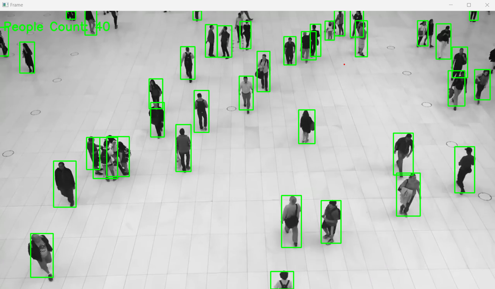

# People Counting in Video Streams

This repository contains a Python script for counting people in a video stream using the YOLO (You Only Look Once) object detection model. It is designed to be an end-to-end solution for processing video footage from surveillance cameras or similar sources to determine the number of people in each frame of the video.

## Authors

- Aditi Vyas (GW ID: G40802010)
  
- Ritwika Das (GW ID: G30941802)

## Guided by

- Professor Robert Pless

## Project Description

The purpose of this project is to demonstrate an end-to-end application of the YOLO object detection system to count people. It processes a video, identifies people using the YOLO model, and counts the total number of people in each frame, displaying this count on the video in real-time.

## Dependencies

- Python 3.8 or later
- OpenCV 4.x
- NumPy

## Installation

To run this project, you need to install the required Python libraries. You can install these packages using pip:

```bash
pip install numpy opencv-python
```

## Yolo Configuration

The script uses pre-trained weights for YOLOv3, which are expected to be in the same directory as the script:

- yolov3.weights

- yolov3.cfg

Make sure these files are correctly placed or update the paths in the script.

## Dataset

### Source

The video data used in this project are sourced from YouTube. These videos are typically used for surveillance purposes and are ideal for testing object detection and counting algorithms due to their varied and realistic settings.

### Description

The dataset consists of video files that capture different scenarios in which people move within the frame of a surveillance camera. Each video varies in length, lighting conditions, and the number of people present, providing a robust set for testing the people-counting model.

### Access

The videos can be accessed through the following link:

- [https://www.youtube.com/watch?v=WvhYuDvH17I&pp=ygUfbWFsbCBjcm93ZGVkIHN1cnZlaWxsYW5jZSB2aWRlbw%3D%3D](#)

### Usage in This Project

In this project, the videos are used to demonstrate and validate the effectiveness of the YOLO-based people counting system. Specific frames from these videos are processed to detect and count the number of people using the trained YOLO model. The results are then displayed in real-time as the video plays.

## Setup for YOLOv3 Object Detection Model

This repository includes a Python script designed to automate the preparation of the YOLOv3 object detection model by downloading the required configuration files and pre-trained weights. The script ensures that all necessary components are downloaded and stored locally, allowing for seamless integration with the main object detection application.

### Dependencies

- Python 3.x
- `requests` library

You can install the required `requests` library using pip:

```bash
pip install requests
```

### Downloaded Files

- YOLOv3 Configuration: The config file (yolov3.cfg) contains model configuration settings essential for the object detection model.

- YOLOv3 Weights: The weights file (yolov3.weights) includes pre-trained weights on the COCO dataset, enabling the model to detect 80 different object classes.

### File Paths

- Weights Path: yolov3.weights
- Config Path: yolov3.cfg

These files are downloaded and stored locally in the same directory as the script. Ensure these paths are correctly referenced in any subsequent scripts used for object detection.

## Results

This image shows a frame from a video being processed by a YOLO object detection system, specifically configured to count people in a crowded setting. Each individual in the frame is enclosed within a green bounding box, which the system uses to identify and track people across the video. The upper-left corner displays a real-time count of the people detected, which in this case is "40". The grayscale tone of the video and the uniformity of the green boxes suggest a focus on clarity and simplicity, optimizing the visibility of the detection framework against the complex background of a busy environment.

 

## What we learnt from the project

Throughout our YOLO object detection project, we implemented an end-to-end application to count people in video frames using the YOLO model. We faced challenges in configuring and setting up the environment with Python, OpenCV, and NumPy to ensure real-time processing and display of people counts. We sourced video data from YouTube, which provided a diverse and realistic set of scenarios for validating the effectiveness of the YOLO-based people counting system. Each video's different conditions—varying lengths, lighting, and crowd density—offered a robust testing ground. We ensured all dependencies and YOLO configurations, including pre-trained weights and config files, were correctly placed to facilitate seamless integration of the detection model. Our experiences taught us valuable lessons in managing real-time data processing and refining object detection techniques for practical applications.
